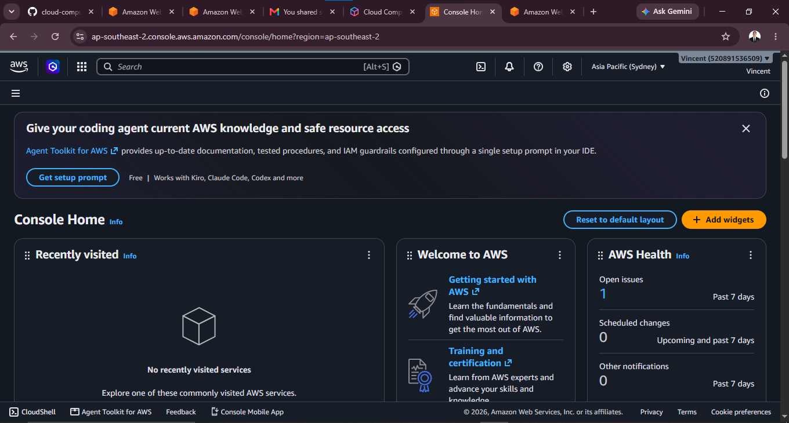

# Amazon Web Services (AWS)

## 1. Brief Overview

Amazon Web Services (AWS) is a cloud computing platform developed by Amazon. It provides cloud services for computing, storage, databases, networking, and more.

## 2. Global Infrastructure

AWS has data centers around the world. These are organized into **Regions** and **Availability Zones**. This helps AWS provide reliable and fast services to users in different locations.

## 3. Cloud Management Console

The **AWS Management Console** is a website where users can create, manage, and monitor AWS services and resources.

### Screenshot

## 4. Four Core Services

### Amazon EC2

Amazon EC2 provides virtual servers that can be used to run applications and websites.

### Amazon S3

Amazon S3 is a storage service used to store files, images, videos, and other data.

### Amazon RDS

Amazon RDS is a managed database service used to store and manage information.

### AWS Lambda

AWS Lambda allows users to run code without managing a physical server.

## 5. Three Advantages

1. **Scalable** – Resources can be increased or decreased when needed.
2. **Reliable** – AWS has infrastructure in many locations around the world.
3. **Many Services** – AWS provides many services for different business and technology needs.

## 6. Typical Enterprise Use Cases

Businesses commonly use AWS for:

* Hosting websites and applications
* Storing and backing up data
* Managing databases
* Running serverless applications
* Data processing and analytics

## Sources

* [AWS Official Website](https://aws.amazon.com/)
* [AWS Global Infrastructure](https://aws.amazon.com/about-aws/global-infrastructure/)
* [AWS Management Console](https://aws.amazon.com/console/)
* [Amazon EC2](https://aws.amazon.com/ec2/)
* [Amazon S3](https://aws.amazon.com/s3/)
* [Amazon RDS](https://aws.amazon.com/rds/)
* [AWS Lambda](https://aws.amazon.com/lambda/)

