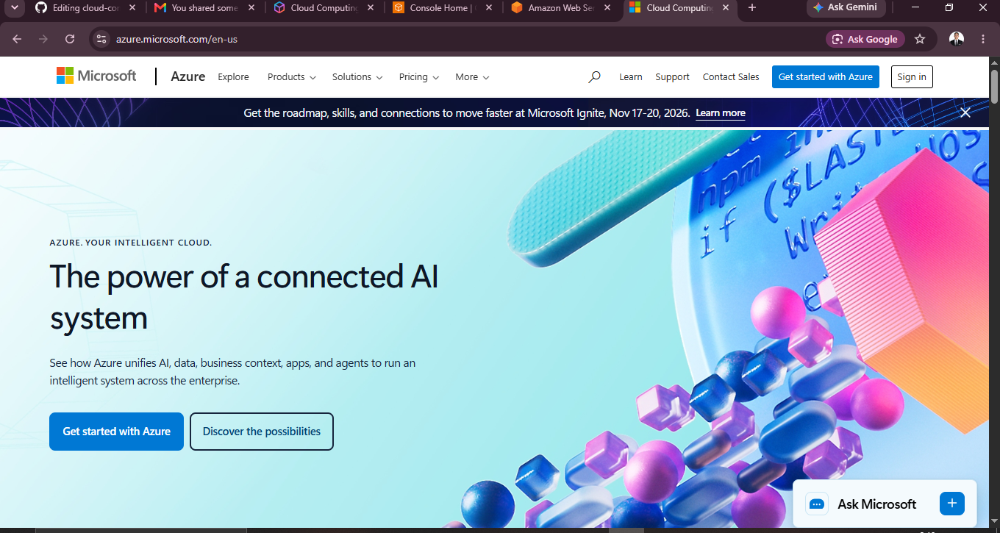

# Microsoft Azure

## 1. Brief Overview

Microsoft Azure is a cloud computing platform developed by Microsoft. It provides services for computing, storage, databases, networking, and application development.

## 2. Global Infrastructure

Azure has data centers in many locations around the world. These are organized into **Regions** and **Availability Zones**. This helps Azure provide reliable and fast cloud services.

## 3. Cloud Management Console

The **Azure Portal** is a web-based management console. Users can create, manage, and monitor Azure services and resources through the portal.

### Screenshot

## 4. Four Core Services

### Azure Virtual Machines

Azure Virtual Machines provide virtual computers that can run applications and websites.

### Azure Blob Storage

Azure Blob Storage is used to store files, images, videos, and other unstructured data.

### Azure SQL Database

Azure SQL Database is a managed database service used to store and manage data.

### Azure Functions

Azure Functions allows users to run code without managing servers.

## 5. Three Advantages

1. **Scalable** – Resources can be increased or decreased when needed.
2. **Reliable** – Azure has infrastructure in many locations around the world.
3. **Microsoft Integration** – Azure works well with Microsoft products and services.

## 6. Typical Enterprise Use Cases

Businesses commonly use Azure for:

* Hosting websites and applications
* Storing and backing up data
* Managing databases
* Running serverless applications
* Data analytics and processing

## Sources

* [Microsoft Azure Official Website](https://azure.microsoft.com/)
* [Azure Global Infrastructure](https://azure.microsoft.com/en-us/explore/global-infrastructure/)
* [Azure Portal](https://portal.azure.com/)
* [Azure Virtual Machines](https://azure.microsoft.com/en-us/products/virtual-machines/)
* [Azure Blob Storage](https://azure.microsoft.com/en-us/products/storage/blobs/)
* [Azure SQL Database](https://azure.microsoft.com/en-us/products/azure-sql/database/)
* [Azure Functions](https://azure.microsoft.com/en-us/products/functions/)

