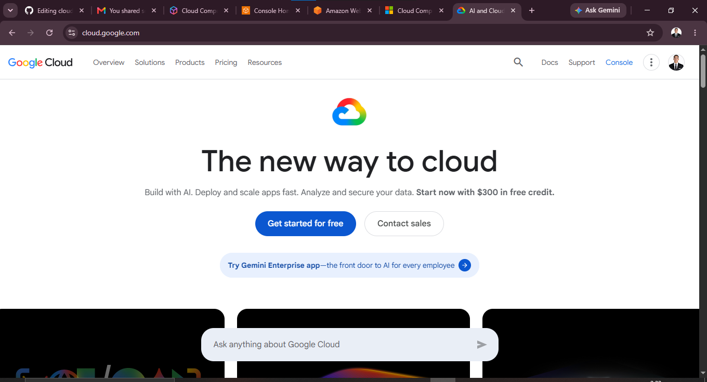

# Google Cloud Platform (GCP)

## 1. Brief Overview

Google Cloud Platform (GCP) is a cloud computing platform developed by Google. It provides services for computing, storage, databases, networking, and data analytics.

## 2. Global Infrastructure

GCP has data centers around the world. These are organized into **Regions** and **Zones**. This helps Google provide reliable and fast cloud services to users in different locations.

## 3. Cloud Management Console

The **Google Cloud Console** is a web-based management console. Users can create, manage, and monitor Google Cloud resources and services.

### Screenshot

## 4. Four Core Services

### Compute Engine

Google Compute Engine provides virtual machines that can be used to run applications and websites.

### Cloud Storage

Google Cloud Storage is used to store files, images, videos, backups, and other data.

### Cloud SQL

Cloud SQL is a managed database service that supports relational databases.

### Google Kubernetes Engine

Google Kubernetes Engine (GKE) is a managed service used to run and manage containerized applications.

## 5. Three Advantages

1. **Scalable** – Resources can be increased or decreased when needed.
2. **Reliable** – GCP has infrastructure in different locations around the world.
3. **Powerful Data Services** – GCP provides strong tools for data analytics and processing.

## 6. Typical Enterprise Use Cases

Businesses commonly use GCP for:

* Hosting websites and applications
* Storing and backing up data
* Managing databases
* Running containerized applications
* Data analytics and processing

## Sources

* [Google Cloud Official Website](https://cloud.google.com/)
* [Google Cloud Global Infrastructure](https://cloud.google.com/about/locations)
* [Google Cloud Console](https://console.cloud.google.com/)
* [Compute Engine](https://cloud.google.com/compute)
* [Cloud Storage](https://cloud.google.com/storage)
* [Cloud SQL](https://cloud.google.com/sql)
* [Google Kubernetes Engine](https://cloud.google.com/kubernetes-engine)

